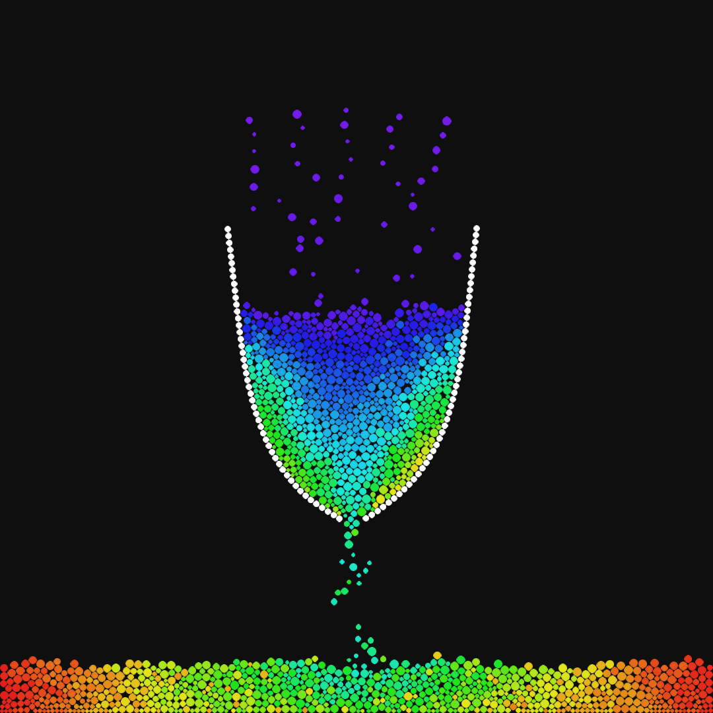

# Verlet Integration
Implementation of a 2d verlet integration physics engine in C++20 and OpenGL with an editor to create particle simulations using a custom entity component system and instanced rendering.

## Dependencies
The repo contains VS2022 solution and project files and uses C++20. All dependencies are included in `external/`
- [GLFW](https://github.com/glfw/glfw) for window management
- [glad](https://github.com/Dav1dde/glad) open gl loader
- [Dear ImGui](https://github.com/ocornut/imgui) for UI control and rendering
- [magic_enum](https://github.com/Neargye/magic_enum) for enum serialization and displaying enums on the UI
- [nlohmann/json](https://github.com/nlohmann/json) for editor scene serialization
- [stb_image](https://github.com/nothings/stb) for loading textures from image files

## Controls
Check out the `Controls` menu item in the editor or load one of the examples (`File > Open`) and then `Simulate` to get started. Particles, spawners and links can be selected to adjust various settings to modify their behaviour during the simulation.

## Technical
| Directory | Description |
| --------- | ----------- |
| `core/` | Classes to render world shapes and constrain particles in them |
| `ecs/`   | A custom archetype based entity component system which is used to handle physics objects (particles and links) and to store render data (transforms and colors) to enable quick instanced rendering by passing data directly into the instancing buffers without additional copies or transformations |
| `editor/` | Editor and serialization logic to modify and store scenes |
| `engine/` | Core engine functionality like window and input initialization and handling |
| `physics/` | Verlet solver and interfaces to resolve collisions, gravity, constraints and all other physics calculations |
| `renderer/` | Simple 2d renderer which supports instanced rendering of quads, circles, lines and textures |
| `simulation/` | Contains simulation data, spawn behaviour and physics components for the ecs |
| `structs/` | Data structs that are used throughout the application (color, gradient, matrix4, vector2) |
| `utils/` | Helper functions for frame stats, math and more |
